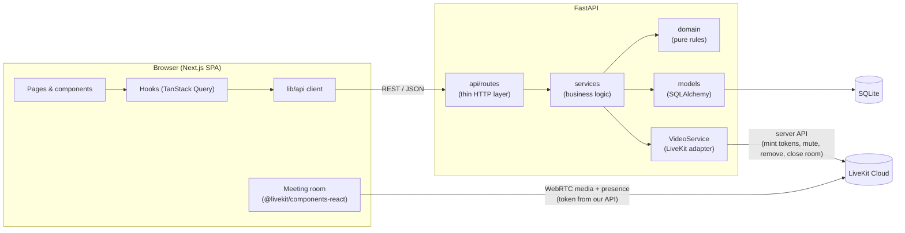
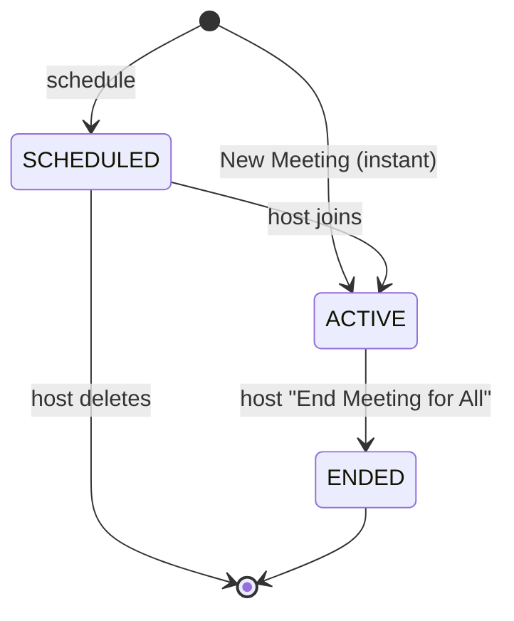
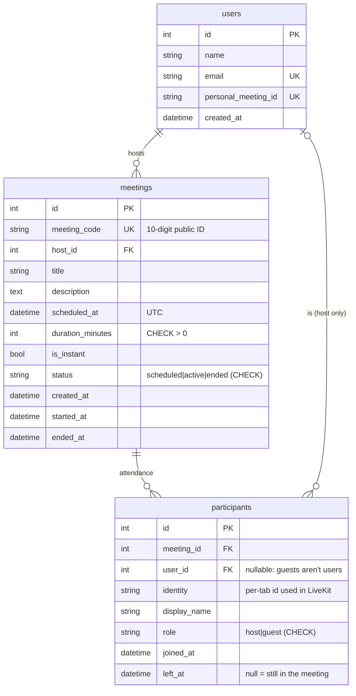
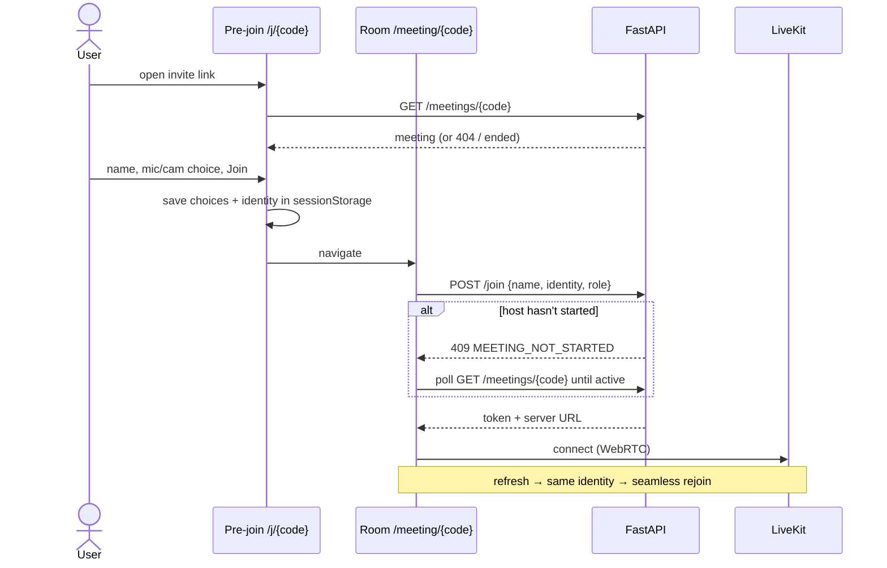

# Architecture

## Overview



**Backend layering.** A request moves through `routes → services → domain/models`:

| Layer | Responsibility | Knows about HTTP? | Knows about DB? |
|---|---|---|---|
| `api/routes` | Parse/validate input (Pydantic), call a service, serialise output | yes | no |
| `services` | Use cases: create, join, end, host controls; transactions | no | yes |
| `domain` | Pure rules: code format, lifecycle transitions, upcoming/recent, text safety | no | no |
| `models` | Tables, relationships, constraints | no | yes |
| `services/video` | `VideoService` protocol + LiveKit implementation | no | no |

The domain layer has no framework imports, so its rules are unit tested in isolation. Services receive their dependencies (DB session, `VideoService`) through constructors wired in `api/deps.py`, so tests swap LiveKit for a fake without patching.

**Frontend layering.** `app/` (routes) → feature components → hooks → `lib/api`. Components never call `fetch`. They use hooks, which use the typed API client. Every failure becomes an `ApiError` with a stable `code`, which `lib/errors.ts` turns into user-facing copy.

## Data ownership

The most important boundary in the system:

| Concern | Owner | Why |
|---|---|---|
| Meeting metadata (title, time, duration, code) | **SQLite** | Durable, queryable, survives restarts |
| Lifecycle status (scheduled / active / ended) | **SQLite** | Business rules (who can join) must be authoritative and server-side |
| Attendance history (who joined, when they left) | **SQLite** (`participants`) | Needed after the meeting ends ("Recent" meetings, attendance table) |
| Live presence (who is connected right now) | **LiveKit** | Changes every second; duplicating it would go stale |
| Media state (mic/camera on, speaking, screen share) | **LiveKit** | Real-time, per-track, peer-driven |

They meet at three points:
1. **Join**: `POST /meetings/{code}/join` checks the lifecycle, records attendance and then mints a LiveKit token. A token is never issued for an ended meeting.
2. **End**: `POST /meetings/{code}/end` marks the meeting ENDED in the DB **first**, then deletes the LiveKit room, which disconnects everyone. If deleting the room fails, the meeting is still ended and no new tokens can be issued. The host's browser leaves the room just before making this call, so its own connection closes cleanly instead of being cut by the server.
3. **Host controls**: mute-all and remove go through our API (authorization check) and then the LiveKit server API. The browser's token carries no admin rights.

## Meeting lifecycle



- Legal transitions are in one table (`domain/lifecycle.py::ALLOWED_TRANSITIONS`). There is no generic "set status" endpoint, only intent-specific ones (`/join`, `/end`, `DELETE`), so invalid transitions such as ENDED → ACTIVE cannot be expressed.
- A host **leaving** (or refreshing, or losing network) does not end the meeting.
- **Upcoming** = ACTIVE, or SCHEDULED with `scheduled_at + duration` in the future. **Recent** = everything else (ENDED, or a SCHEDULED meeting whose slot passed). Both are computed at read time, so no cron job flips statuses.

## Database schema



Design notes:
- **`meeting_code` vs `id`.** The integer primary key stays internal, and the random 10-digit code is the public identifier in URLs. Codes come from `secrets` (not `random`) because knowing the code is enough to join. A pre-insert check avoids collisions, and the `UNIQUE` constraint is the final guarantee.
- **Invite link is derived, not stored**: `PUBLIC_APP_URL + /j/{code}`. One source of truth, and changing the domain doesn't need a data migration.
- **`UNIQUE(meeting_id, identity)`.** One attendance row per browser tab per meeting. Rejoining after a refresh re-opens the same row instead of duplicating it.
- **`participants.user_id` is nullable** because guests are not registered users. `ON DELETE SET NULL` keeps attendance history if a user is deleted, while `meetings → participants` cascades.
- **Integrity in the database, not just in code**: foreign keys (SQLite needs `PRAGMA foreign_keys=ON`, set per connection in `db/session.py`), `CHECK` constraints for status/role/duration, and a deterministic constraint naming convention.
- **UTC everywhere.** SQLite drops time zone info, so the `UTCDateTime` column type rejects naive datetimes on write and tags values as UTC on read. The API emits `...Z` and the browser converts to local time.
- **Index** `(host_id, status, scheduled_at)` matches the dashboard queries.
- `create_all` + idempotent seeding fits this scope. Alembic migrations would be the next step for an evolving production schema.

## API

All endpoints are under `/api`. Errors always look like:
```json
{ "error": { "code": "MEETING_ENDED", "message": "This meeting has ended.", "details": [] } }
```

| Method & path | Purpose | Notable responses |
|---|---|---|
| `GET /health` | Liveness + whether video is configured | |
| `GET /me` | Default (logged-in) user | |
| `POST /meetings/instant` | New Meeting (created ACTIVE) | 201 |
| `POST /meetings` | Schedule a meeting | 201, 400 validation |
| `GET /meetings/upcoming` | Live + future meetings, soonest first | |
| `GET /meetings/recent` | Ended + missed meetings, newest first | |
| `GET /meetings/{code}` | Validate a meeting ID / get details | 404 unknown, 400 malformed |
| `POST /meetings/{code}/join` | Record attendance + get a LiveKit token | 404, 410 ended, 409 host not started, 403 not host, 503 video not configured |
| `POST /meetings/{code}/participants/{identity}/leave` | Mark left (body-less, works with `sendBeacon`) | 204, idempotent |
| `GET /meetings/{code}/participants` | Attendance history (host) | |
| `POST /meetings/{code}/end` | End Meeting for All (host) | 200, idempotent, 409 if never started |
| `DELETE /meetings/{code}` | Delete a scheduled meeting (host) | 204, 409 if started |
| `POST /meetings/{code}/host/mute-all` | Mute everyone except the host | 204, 409 if not live |
| `POST /meetings/{code}/host/remove` | Remove a participant | 204, 404, 409 (can't remove host) |

Validation errors return **400** (FastAPI's default 422 is remapped) with per-field `details`, which the Schedule form shows next to the matching input.

## Frontend flow



- **sessionStorage** holds the pre-join choices and a per-tab identity. A refresh rejoins as the same participant (LiveKit replaces the stale connection, and the DB re-opens the same attendance row). A second tab is a separate participant.
- **Reconnection**: LiveKit reconnects automatically after network blips, and the UI shows a "Reconnecting…" banner. If it gives up, a "You've been disconnected" screen offers **Rejoin**.
- **Disconnect reasons** map to clear screens: `ROOM_DELETED` → "ended by the host", `PARTICIPANT_REMOVED` → "removed", `DUPLICATE_IDENTITY` → "joined from another window".
- **Expected disconnects are not errors**: when the server closes a guest's connection (meeting ended, or removed), livekit-client logs data-channel errors. `lib/livekit-logging.ts` filters exactly those messages; every other log is untouched.
- **Device permissions denied**: the pre-join preview explains how to unblock. In the room, the user joins without that device and gets a toast.
- **Double-click on New Meeting**: the button disables while the request runs, and a ref guard drops a second click fired before React re-renders. The test suite asserts exactly one API call.

## Edge cases

| Scenario | Behaviour |
|---|---|
| No upcoming/recent meetings | Zoom-style empty states, never blank |
| Backend unreachable | Cards show "Couldn't load this" + Try again; actions show a toast |
| Malformed meeting ID | Rejected in the browser (no API call); the API also returns 400 for malformed path codes |
| Unknown meeting ID | 404 → "This meeting ID is not valid" |
| Meeting already ended | Join page / pre-join / API (410) all refuse |
| Guest joins before host | Waiting screen, auto-joins when the host starts |
| Empty or > 50-char name / HTML in name | Join disabled / inline error; API rejects with 400 |
| Scheduling in the past | Date picker `min`, form validation, API 400 (2-minute clock-skew tolerance) |
| Host leaves | Meeting continues; only "End Meeting for All" ends it |
| Host ends | DB → ENDED, room closed, guests see "ended by the host", rejoin returns 410 |
| Camera/mic denied | Preview explains; join continues without that device |
| Clipboard API unavailable/denied | Dialog with the text pre-selected in a read-only field |
| Page refresh / network drop | Silent rejoin with the same identity / Reconnecting banner |
| XSS in title/description/name | Rejected server-side (HTML tag pattern); React escapes all output anyway |
| Unknown LiveKit config | `/join` returns 503 before changing any state |

## Trade-offs and next steps
- **Auth**: real login (e.g. JWT/OAuth) only requires changing `get_current_user`.
- **Webhooks**: LiveKit webhooks (`participant_joined/left`, `room_finished`) would make attendance exact even if a browser never sends its leave beacon.
- **Migrations**: Alembic for schema evolution. Postgres for multi-instance deployments (SQLite on a single instance is fine here).
- **Recurring meetings, waiting room, passcodes, recordings** are out of scope.
